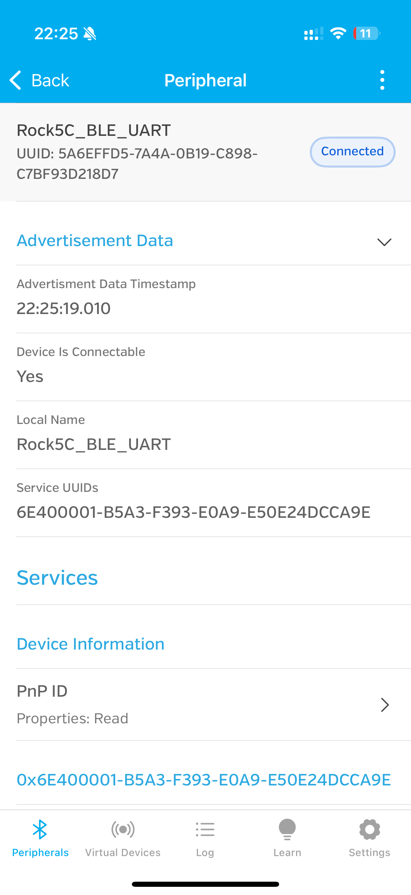

# BLE UART 服务实现

这个项目实现了基于 BlueZ D-Bus API 的 BLE UART 服务，用于在 RK3588 开发板上提供 Nordic UART Service (NUS)。项目包含两种实现方式：基于 C++ 的 sdbus-cpp 实现和基于 Python 的 BLESS 实现。

## 功能演示

### 1. 服务器启动

服务器成功启动，显示服务和特征 UUID

### 2. 客户端连接

iPhone LightBlue 应用成功连接到服务器

### 3. 数据交互

实现与客户端的数据收发功能

## 实现方式

本项目提供了两种实现方式：

### 1. C++ 实现 (基于 bluez-dbus-cpp)

使用 C++ 和 bluez-dbus-cpp 库实现的 BLE UART 服务，通过 BlueZ D-Bus API 与蓝牙硬件交互。bluez-dbus-cpp 是一个基于 sdbus-cpp 的高级封装库，提供了更简洁的 BlueZ D-Bus API 接口。

- **文件**：
  - `nus_simple.cpp`：基于 bluez-dbus-cpp 的 Nordic UART Service 实现
  - `Makefile.nus_simple`：编译和安装脚本
  - `org.example.ble_uart.conf`：D-Bus 配置文件
  - `nus-simple.service`：systemd 服务文件

### 2. Python 实现 (基于 BLESS)

使用 Python 和 BLESS 库实现的 BLE UART 服务，提供更简洁的 API 和更易于理解的代码。

- **文件**：
  - `bless_uart_server.py`：基于 BLESS 的 Nordic UART Service 实现
  - `requirements.txt`：Python 依赖包列表

## 功能特点

- 实现标准的 Nordic UART Service (NUS)
- 支持 BLE GATT 服务器功能
- 提供双向通信能力（读写和通知）
- 完整的错误处理和日志记录
- 连接管理和状态监控
- 支持与 iPhone LightBlue 等 BLE 客户端应用通信

## 硬件要求

- RK3588 开发板 (Rock 5C)
- 内置或外接蓝牙适配器
- 支持 BLE 的客户端设备（如智能手机）

## 软件要求

- Linux 操作系统（已在 Debian 11 上测试）
- BlueZ 5.55+
- 对于 C++ 实现：
  - g++ 编译器 (支持 C++17)
  - sdbus-cpp 库
  - bluez-dbus-cpp 库
- 对于 Python 实现：
  - Python 3.7+
  - bless 库

## 蓝牙驱动

本项目包含 Rock 5C 开发板所需的蓝牙驱动文件：

- `aic8800-firmware_3.0+git20240327.3561b08f-5_all.deb` - AICSemi AIC 8800D80 蓝牙芯片的固件包
- `aic8800-usb-dkms_3.0+git20240327.3561b08f-5_all.deb` - AICSemi AIC 8800D80 蓝牙芯片的 DKMS 驱动包

这些驱动文件是 Rock 5C 开发板上蓝牙功能正常工作所必需的。如果您使用的是 Rock 5C 开发板，可能需要安装这些驱动：

```bash
sudo dpkg -i aic8800-firmware_3.0+git20240327.3561b08f-5_all.deb
sudo dpkg -i aic8800-usb-dkms_3.0+git20240327.3561b08f-5_all.deb
sudo reboot
```

安装驱动后，需要重启系统以使驱动生效。

## 使用方法

### C++ 实现 (nus_simple)

#### 依赖文件

- **源代码文件**：
  - `nus_simple.cpp` - 主程序源代码
  - `Makefile.nus_simple` - 编译脚本
  - `org.example.ble_uart.conf` - D-Bus 配置文件
  - `nus-simple.service` - systemd 服务文件

- **依赖库**：
  - `bluez-dbus-cpp` - BlueZ D-Bus C++ 封装库
  - `sdbus-c++` - D-Bus C++ 绑定库
  - `pthread` - POSIX 线程库

#### 编译步骤

1. 确保已安装所需的依赖库：
```bash
# 安装 sdbus-c++ 库
sudo apt-get install libsdbus-c++-dev

# 确保 bluez-dbus-cpp 库已编译
cd bluez-dbus-cpp
mkdir -p build && cd build
cmake ..
make
cd ../..
```

2. 编译 nus_simple 程序：
```bash
make -f Makefile.nus_simple
```

编译过程会执行以下命令：
```bash
g++ -std=c++17 -Wall -Wextra -g -I./bluez-dbus-cpp/include -I./bluez-dbus-cpp -o nus_simple nus_simple.cpp -L./bluez-dbus-cpp/build -lbluez-dbus-cpp -lsdbus-c++ -pthread
```

#### 配置文件说明

本项目包含两个重要的配置文件：

1. **D-Bus 配置文件 (`org.example.ble_uart.conf`)**

   这个文件定义了 BlueZ D-Bus 接口的访问权限，是程序正常工作的关键：

   - **用途**：允许程序访问 BlueZ 的 D-Bus 接口，解决 "No object received" 错误
   - **内容**：定义了哪些用户和进程可以访问蓝牙功能，以及允许访问的 D-Bus 接口
   - **位置**：需要安装到 `/etc/dbus-1/system.d/` 目录
   - **重要性**：没有这个配置文件，BLE UART 服务将无法获得访问 BlueZ D-Bus 接口的权限

   文件内容示例：
   ```xml
   <!DOCTYPE busconfig PUBLIC "-//freedesktop//DTD D-BUS Bus Configuration 1.0//EN"
    "http://www.freedesktop.org/standards/dbus/1.0/busconfig.dtd">
   <busconfig>
     <policy user="root">
       <allow own="org.bluez"/>
       <allow send_destination="org.bluez"/>
       <allow send_interface="org.bluez.GattManager1"/>
       <allow send_interface="org.bluez.LEAdvertisingManager1"/>
       <!-- 其他接口权限 -->
     </policy>
     <policy context="default">
       <allow send_destination="org.bluez"/>
       <allow send_interface="org.bluez.GattManager1"/>
       <!-- 其他接口权限 -->
     </policy>
   </busconfig>
   ```

2. **Systemd 服务文件 (`nus-simple.service`)**

   这个文件定义了如何将 BLE UART 服务作为系统服务运行：

   - **用途**：允许服务在系统启动时自动运行，提供后台运行能力
   - **内容**：定义服务依赖、启动条件、重启策略和环境变量
   - **位置**：安装到 `~/.config/systemd/user/` 目录（用户级服务）
   - **重要性**：如果需要服务在后台运行或开机自启动，则需要此文件

   文件内容示例：
   ```ini
   [Unit]
   Description=Nordic UART Service BLE Server
   After=bluetooth.service
   Requires=bluetooth.service

   [Service]
   Type=simple
   ExecStart=/home/radxa/bluetooth_toolkit/nus_simple
   Restart=on-failure
   RestartSec=5
   Environment=DBUS_SESSION_BUS_ADDRESS=unix:path=/run/dbus/system_bus_socket

   [Install]
   WantedBy=default.target
   ```

#### 安装和运行

1. 安装 D-Bus 配置文件（需要 root 权限）：
```bash
make -f Makefile.nus_simple install-conf
```

这会执行以下命令：
```bash
sudo cp org.example.ble_uart.conf /etc/dbus-1/system.d/
sudo systemctl reload dbus
```

**注意**：这一步是必须的，否则程序将无法访问 BlueZ D-Bus 接口，会出现 "No object received" 错误。

2. 直接运行程序（使用 sudo）：
```bash
make -f Makefile.nus_simple run
```

这会执行以下命令：
```bash
sudo LD_LIBRARY_PATH=./bluez-dbus-cpp/build ./nus_simple
```

3. 或者安装并启动 systemd 服务（可选，用于后台运行）：
```bash
make -f Makefile.nus_simple install-service
systemctl --user start nus-simple.service
```

**服务管理命令**：
- 启动服务：`systemctl --user start nus-simple.service`
- 停止服务：`systemctl --user stop nus-simple.service`
- 查看状态：`systemctl --user status nus-simple.service`
- 设置开机启动：`systemctl --user enable nus-simple.service`
- 取消开机启动：`systemctl --user disable nus-simple.service`

#### Makefile.nus_simple 说明

Makefile.nus_simple 包含以下主要目标：

- `all`：默认目标，编译 nus_simple 程序
- `install-conf`：安装 D-Bus 配置文件
- `install-service`：安装 systemd 服务
- `run`：以 root 权限运行程序
- `clean`：清理编译生成的文件

完整的 Makefile.nus_simple 内容：
```makefile
CXX = g++
CXXFLAGS = -std=c++17 -Wall -Wextra -g
LDFLAGS = -lsdbus-c++ -pthread

# 目标文件
TARGET = nus_simple

# 源文件
SRCS = nus_simple.cpp

# 包含路径 - 添加 example 目录以找到 SerialCharacteristic.h
INCLUDES = -I./bluez-dbus-cpp/include -I./bluez-dbus-cpp

# 库路径和库
LIBS = -L./bluez-dbus-cpp/build -lbluez-dbus-cpp

# 目标规则
all: $(TARGET)

$(TARGET): $(SRCS)
	$(CXX) $(CXXFLAGS) $(INCLUDES) -o $@ $^ $(LIBS) $(LDFLAGS)

# 安装 D-Bus 配置文件（需要 root 权限）
install-conf:
	sudo cp org.example.ble_uart.conf /etc/dbus-1/system.d/
	sudo systemctl reload dbus

# 安装用户级别的 systemd 服务
install-service:
	mkdir -p ~/.config/systemd/user/
	cp nus-simple.service ~/.config/systemd/user/
	systemctl --user daemon-reload
	@echo "服务已安装。使用以下命令启动服务："
	@echo "systemctl --user start nus-simple.service"
	@echo "使用以下命令设置开机自启动："
	@echo "systemctl --user enable nus-simple.service"

# 运行程序（使用 sudo 以获取足够的权限）
run:
	sudo LD_LIBRARY_PATH=./bluez-dbus-cpp/build ./$(TARGET)

clean:
	rm -f $(TARGET)

.PHONY: all clean install-conf install-service run
```

### Python 实现

1. 安装依赖：
```bash
pip install -r requirements.txt
```

2. 确保蓝牙控制器已启动：
```bash
sudo hciconfig hci0 up
```

3. 运行服务器：
```bash
python3 bless_uart_server.py
```

## 连接和使用

使用 BLE 客户端（如 iPhone 的 LightBlue 应用）连接到设备：
- 设备名称：RK3588_BLE_UART（C++ 实现）或 Rock5C_BLE_UART（Python 实现）
- 服务 UUID：6E400001-B5A3-F393-E0A9-E50E24DCCA9E
- RX 特征 UUID：6E400002-B5A3-F393-E0A9-E50E24DCCA9E（写入）
- TX 特征 UUID：6E400003-B5A3-F393-E0A9-E50E24DCCA9E（通知/读取）

## 部署指南

将代码部署到其他环境时，需要考虑以下路径和环境变量：

### 路径依赖

1. **可执行文件路径**
   - `nus_simple` 可执行文件的路径在 systemd 服务文件中是硬编码的
   - 如果部署到不同位置，需要修改 `nus-simple.service` 文件中的 `ExecStart` 路径

2. **库文件路径**
   - `bluez-dbus-cpp` 库的路径通过 `LD_LIBRARY_PATH` 环境变量指定
   - 在运行时需要设置 `LD_LIBRARY_PATH` 指向 `bluez-dbus-cpp/build` 目录
   - 或者将库安装到系统库路径（如 `/usr/local/lib`）

3. **配置文件路径**
   - D-Bus 配置文件必须安装到 `/etc/dbus-1/system.d/` 目录
   - systemd 服务文件安装到 `~/.config/systemd/user/` 目录（用户级服务）或 `/etc/systemd/system/` 目录（系统级服务）

### 部署步骤

1. **复制文件到目标位置**
   ```bash
   # 创建目标目录
   sudo mkdir -p /opt/ble_uart

   # 复制必要文件
   sudo cp nus_simple /opt/ble_uart/
   sudo cp -r bluez-dbus-cpp /opt/ble_uart/
   sudo cp org.example.ble_uart.conf /etc/dbus-1/system.d/
   ```

2. **修改 systemd 服务文件**
   ```bash
   # 编辑服务文件，更新路径
   sed 's|/home/radxa/bluetooth_toolkit/nus_simple|/opt/ble_uart/nus_simple|g' nus-simple.service > /tmp/nus-simple.service

   # 安装服务文件
   mkdir -p ~/.config/systemd/user/
   cp /tmp/nus-simple.service ~/.config/systemd/user/
   systemctl --user daemon-reload
   ```

3. **安装库文件（可选）**
   ```bash
   # 编译并安装 bluez-dbus-cpp 库到系统路径
   cd /opt/ble_uart/bluez-dbus-cpp
   mkdir -p build && cd build
   cmake -DCMAKE_INSTALL_PREFIX=/usr/local ..
   make
   sudo make install
   sudo ldconfig
   ```

4. **创建启动脚本**
   ```bash
   # 创建包含正确环境变量的启动脚本
   cat > /opt/ble_uart/start_nus.sh << 'EOF'
   #!/bin/bash
   export LD_LIBRARY_PATH=/opt/ble_uart/bluez-dbus-cpp/build:$LD_LIBRARY_PATH
   /opt/ble_uart/nus_simple
   EOF

   # 设置执行权限
   chmod +x /opt/ble_uart/start_nus.sh
   ```

5. **更新 systemd 服务使用启动脚本**
   ```bash
   # 编辑服务文件，使用启动脚本
   sed 's|ExecStart=/opt/ble_uart/nus_simple|ExecStart=/opt/ble_uart/start_nus.sh|g' ~/.config/systemd/user/nus-simple.service > /tmp/nus-simple.service
   cp /tmp/nus-simple.service ~/.config/systemd/user/
   systemctl --user daemon-reload
   ```

6. **检查并修改源代码中的硬编码路径**

   在源代码中可能存在硬编码的路径，需要在部署时修改：

   ```bash
   # 查找源代码中的硬编码路径
   grep -r "/home/radxa" /opt/ble_uart

   # 如果找到硬编码路径，需要修改源代码并重新编译
   # 例如，修改 nus_simple.cpp 中的路径
   sed -i 's|/home/radxa/bluetooth_toolkit|/opt/ble_uart|g' /opt/ble_uart/nus_simple.cpp

   # 重新编译
   cd /opt/ble_uart
   g++ -std=c++17 -Wall -Wextra -g -I./bluez-dbus-cpp/include -I./bluez-dbus-cpp -o nus_simple nus_simple.cpp -L./bluez-dbus-cpp/build -lbluez-dbus-cpp -lsdbus-c++ -pthread
   ```

### 环境变量

在部署时需要考虑以下环境变量：

1. **LD_LIBRARY_PATH**
   - 用于指定动态库的搜索路径
   - 必须包含 `bluez-dbus-cpp/build` 目录
   - 示例：`export LD_LIBRARY_PATH=/opt/ble_uart/bluez-dbus-cpp/build:$LD_LIBRARY_PATH`

2. **DBUS_SESSION_BUS_ADDRESS**
   - 用于指定 D-Bus 会话总线地址
   - 在 systemd 服务文件中设置为 `unix:path=/run/dbus/system_bus_socket`
   - 示例：`export DBUS_SESSION_BUS_ADDRESS=unix:path=/run/dbus/system_bus_socket`

3. **PATH**
   - 如果将可执行文件安装到非标准位置，需要更新 PATH 环境变量
   - 临时设置：`export PATH=/opt/ble_uart:$PATH`
   - 永久设置（对当前用户）：
     ```bash
     echo 'export PATH=/opt/ble_uart:$PATH' >> ~/.bashrc
     source ~/.bashrc
     ```
   - 永久设置（对所有用户）：
     ```bash
     sudo bash -c 'echo "export PATH=/opt/ble_uart:$PATH" > /etc/profile.d/ble_uart.sh'
     sudo chmod +x /etc/profile.d/ble_uart.sh
     ```
   - 在 systemd 服务文件中设置：
     ```ini
     [Service]
     Environment="PATH=/opt/ble_uart:/usr/local/sbin:/usr/local/bin:/usr/sbin:/usr/bin:/sbin:/bin"
     ```

## 常见问题解决

### 1. LightBlue 应用请求配对
**问题**：使用 LightBlue 连接设备时持续请求配对。

**解决方案**：
- 程序已经通过设置 `adapter1.Pairable(false)` 禁用了配对功能
- 无需在 LightBlue 中进行配对操作，可直接连接使用

### 2. 找不到动态库
**问题**：运行时报错 "找不到 libbluez-dbus-cpp.so.0"

**解决方案**：
- 使用 LD_LIBRARY_PATH 指定库文件路径：
```bash
LD_LIBRARY_PATH=./bluez-dbus-cpp/build:$LD_LIBRARY_PATH ./nus_simple
```

## 使用说明
1. 编译并运行程序
2. 打开 LightBlue 应用
3. 扫描并连接设备（设备名为 "Q_RK3588_BLE_DEVICE"）
4. 连接后可以开始收发数据

## 许可证
[许可证信息]

## 贡献
欢迎提交问题报告和改进建议。

## 开发日志

详细的开发过程和问题解决方案记录在 `development_log.md` 文件中。

## 参考资料

- [BlueZ D-Bus API 文档](https://git.kernel.org/pub/scm/bluetooth/bluez.git/tree/doc)
- [sdbus-cpp 文档](https://github.com/Kistler-Group/sdbus-cpp)
- [bluez-dbus-cpp 库](https://github.com/audiofile/bluez-dbus-cpp)
- [BLESS 库文档](https://github.com/kevincar/bless)
- [Nordic UART Service 规范](https://infocenter.nordicsemi.com/index.jsp?topic=%2Fcom.nordic.infocenter.sdk5.v14.0.0%2Fble_sdk_app_nus_eval.html)
